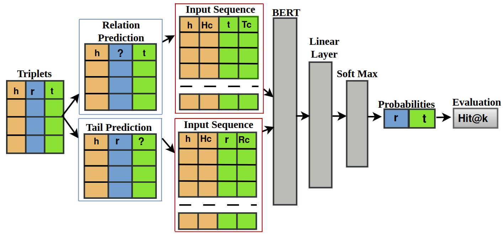
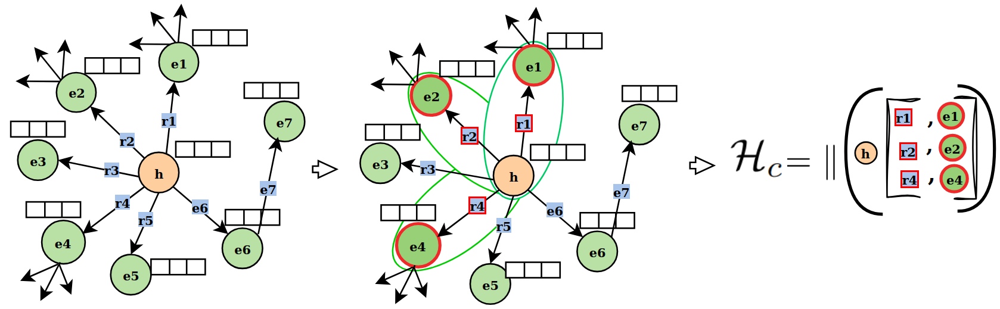
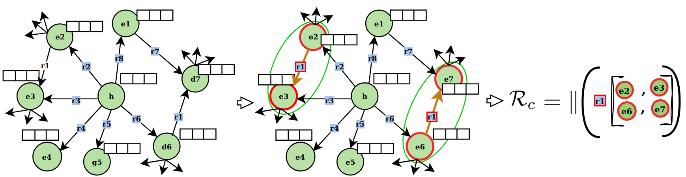

# MuCoS: Efficient Drug-Target Discovery via Multi-Context-Aware Sampling in Knowledge Graphs

**Official PyTorch Implementation** of the MuCoS model presented in:

> **MuCoS: Efficient Drug-Target Discovery via Multi-Context-Aware Sampling in Knowledge Graphs**  
> Haji Gul<sup>a</sup>, Abdul Ghani Naim<sup>b</sup>, Ajaz Ahmad Bhat<sup>*1</sup>  
> School of Digital Science, Universiti Brunei Darussalam  
> **BioNLP 2025** (Proceedings of the 24th Workshop on Biomedical Language Processing)

**Paper Link**: [https://aclanthology.org/search/?q=MuCos-KGC](https://aclanthology.org/2025.bionlp-1.27/)


---

## Abstract
Accurate prediction of drug–target interactions is critical for accelerating drug discovery. In this work, we frame drug–target prediction as a link prediction task on heterogeneous biomedical knowledge graphs (KG) that integrate drugs, proteins, diseases, pathways, and other relevant entities. Conventional KG embedding methods such as TransE and ComplExSE are hindered by their reliance on computationally intensive negative sampling and their limited generalization to unseen drug–target pairs. To address these challenges, we propose Multi-Context-Aware Sampling (MuCoS), a novel framework that prioritizes high-density neighbours to capture salient structural patterns and integrates these with contextual embeddings derived from BERT. By unifying structural and textual modalities and selectively sampling highly informative patterns, MuCoS circumvents the need for negative sampling, significantly reducing computational overhead while enhancing predictive accuracy for novel drug–target associations and drug targets. Extensive experiments on the KEGG50k and PharmKG-8k datasets demonstrate that MuCoS outperforms baselines, achieving up to a 13% improvement in MRR for general relation prediction on KEGG50k, a 22% improvement on PharmKG-8k, and a 6% gain in dedicated drug–target relation prediction on KEGG50k


By unifying structural and textual modalities and selectively sampling highly informative patterns, MuCoS **eliminates negative sampling**, significantly reduces computational overhead, and improves generalization to unseen drug-target pairs.

**Key Results**:
- **+13% MRR** on general relation prediction (KEGG50k)
- **+22% MRR** on PharmKG-8k
- **+6% MRR** on dedicated drug-target relation prediction (KEGG50k)

---

##  Features

- **Density-based Multi-Context Sampling** (Head, Tail, and Relation contexts)
- **BERT-based sequence classification** (supports `bert-base-uncased`, DistilBERT, RoBERTa)
- **No negative sampling** required
- **Efficient context extraction**  
  - `n` – number of top‑density neighbours used for head/tail contexts  
  - `k` – number of top‑density entity pairs used for relation context  
  - Sampling reduces computational complexity from `O(avg_density + avg_appearance)` to `O(2n + k)`
- **Dual prediction tasks**  
  - **Link prediction** – infer the missing relation in `(h, ?, t)`  
  - **Tail prediction** – infer the missing entity in `(h, r, ?)`  
- **Two evaluation settings**    
  - **General** – all relations and entities in the KG  
  - **Drug‑target specific** – only drug‑target interactions  

---

##  Model Pipeline

### Figure 1: MuCoS Overall Pipeline
  
**Figure 1:** A concise overview of the MuCoS model pipeline, which is designed to predict general and drug-target relations and tail entities. The boxes on the left show the input sequence to the BERT model, where (h) head, (Hc) head context, (t) tail, (Tc) tail context, (r) relation, and (Rc) relation context. This integrated context is passed through the BERT model with a linear classifier and softmax function to generate probabilities for relations and tail.


### Figure 2: Head Context (Hc) Construction with Sampling
  
**Figure 2:** MuCoS $\mathcal{H}_c$ construction. The left graphical view illustrates one hop head $h$ context, which consists of the set of relations $\mathcal{R}(h)$ ($r_1, r_2, r_3, r_4, r_5, r_6$) and the set of neighbouring tail entities $\mathcal{E}(h)$ ($e_1, e_2, e_3, e_4, e_5, e_6$) associated with the head entity $h$. The middle view shows the sampling process, where only the top-$n$ (suppose $n = 3$) tail entities $e$ are selected and concatenated (||) based on their density $\rho(e)$, to calculate the optimized head context $\mathcal{H}_c$.

### Figure 3: Relation Context (Rc) Construction with Sampling
  
**Figure 3:** $\mathcal{R}_c$ construction. The left view illustrates the relationship $r_1$ and entities (head, tail) connected by $r_1$. The graph in the middle depicts optimization, selecting the top $k$ (suppose $k = 2$) entities based on density $\rho$, retaining pairs such as $(e_2, e_3)$ and $(e_6, e_7)$. The optimized context $\mathcal{R}_c$ is aggregated using concatenation ($||$), as shown in the right section.


---

## Project Structure

```bash
MuCoS/  (Run relation prediction file --> python train.py)
├── relation_prediction/          # General link prediction (h, ?, t) - all relations
│   ├── config.py
│   ├── data_loader.py
│   ├── utils.py
│   ├── model.py
│   ├── train.py 
│
├── specific_relation_prediction/ # Drug-target specific relation prediction (h, ?, t) , ? = r_i
│   ├── main.py
│   ├── train.py
│   ├── dataset.py
│   ├── utils.py
│   ├── model.py
│   └── ... 
│
├── tail_prediction/              # Tail entity prediction (h, r, ?)
│   ├── main.py
│   ├── train.py
│   ├── dataset.py
│   ├── utils.py
│   ├── model.py
│   └── ...
│
├──  
│   ├── figure1.png
│   ├── figure2.png
│   └── figure3.png
│
├── requirements.txt
├── README.md
└── ... 
```
## Installation
```bash
git clone
cd MuCoS
```

# Create virtual environment (optional but recommended)
```bash
python -m venv venv
source venv/bin/activate    # Linux/Mac
```

# venv\Scripts\activate     # Windows
```bash
pip install -r requirements.txt
```


@inproceedings{gul-etal-2025-mucos,  
    title = "MuCoS: Efficient Drug-Target Discovery via Multi-Context-Aware Sampling in Knowledge Graphs",  
    author = "Gul, Haji  and Naim, Abdul Ghani  and Bhat, Ajaz Ahmad",  
    editor = "Demner-Fushman, Dina  and Ananiadou, Sophia  and Miwa, Makoto  and Tsujii, Junichi",  
    booktitle = "Proceedings of the 24th Workshop on Biomedical Language Processing",  
    month = aug,  
    year = "2025",  
    address = "Viena, Austria",  
    publisher = "Association for Computational Linguistics",  
    url = "https://aclanthology.org/2025.bionlp-1.27/",  
    doi = "10.18653/v1/2025.bionlp-1.27",  
    pages = "319--327",  
    ISBN = "979-8-89176-275-6"  
}
